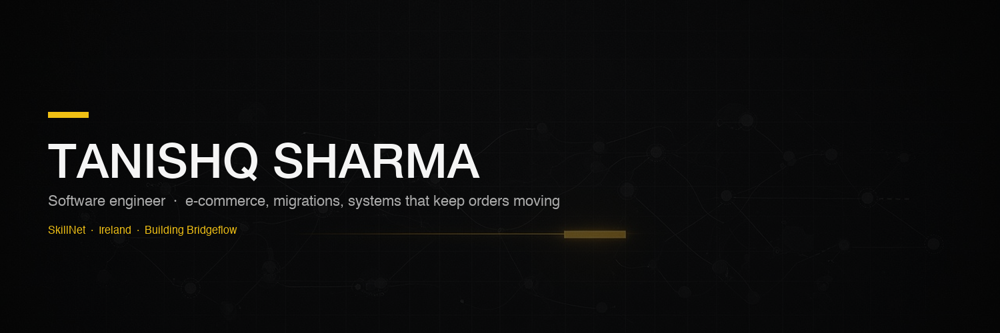

  

  
  &nbsp;
  
  &nbsp;
  
  &nbsp;
  
  &nbsp;
  

---

Hey — I'm **Tanishq**, a software engineer who likes the messy middle of products: storefronts, integrations, and the systems that keep orders moving.

I've spent most of my career in e-commerce — VTEX, Spryker, wholesale platforms — and I build my own tools on the side.

**Now:** Associate Consultant at SkillNet · Ireland  
**Building:** [Bridgeflow](https://bridgeflow.app) — visual, flow-based e-commerce migrations

## Stack

  

  
  
  
  
  
  

## Building

- **[Bridgeflow](https://bridgeflow.app)** ([Migratify](https://github.com/SharmaTanishq/Migratify)) — drag-and-drop Bridges to move products, orders, and customers between stacks
- **[BetterLog](https://github.com/SharmaTanishq/BetterLogs)** — workflow observability that answers “what happened to this order?” across services

## Connect

  
  &nbsp;&nbsp;&nbsp;
  
  &nbsp;&nbsp;&nbsp;
  
  &nbsp;&nbsp;&nbsp;
  

  
  

